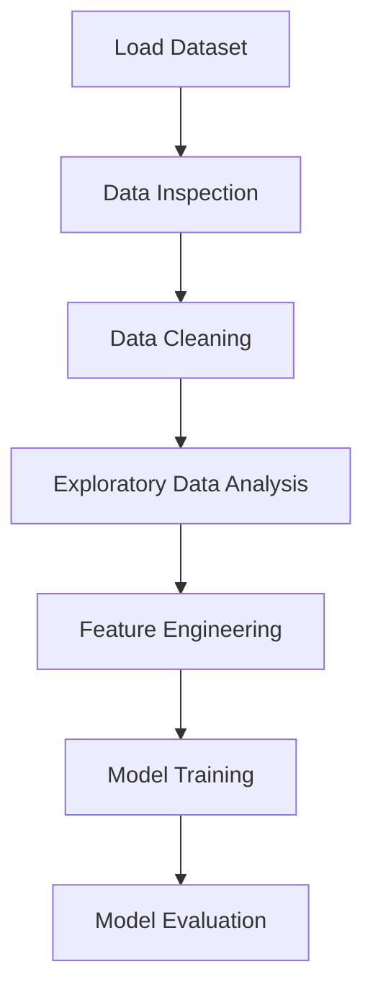

# 🏦 Loan Approval Prediction Project


This project focuses on **predicting loan approval using Machine Learning techniques**.
The goal is to analyze applicant data and build a model that can **predict whether a loan application will be approved or rejected**.

This project demonstrates a **complete data science workflow**, including data preprocessing, exploratory analysis, model training, and evaluation.

---

# 📌 Project Overview

Financial institutions receive thousands of loan applications. Manually evaluating every application is **time-consuming and prone to human bias**.

Using **Machine Learning**, we can automate the loan approval prediction process.

In this project, we perform:

* Data inspection
* Data cleaning
* Exploratory Data Analysis (EDA)
* Feature engineering
* Machine Learning model training
* Model evaluation

The objective is to **build a predictive model that can help financial institutions make faster decisions**.

---

# 🧠 Machine Learning Workflow



---

# ⚙️ Technologies Used

* Python
* Pandas
* NumPy
* Matplotlib
* Seaborn
* Scikit-Learn
* Jupyter Notebook

---

# 📊 Key Analysis Performed

### 1️⃣ Data Inspection

* Checking dataset structure
* Viewing dataset shape
* Identifying missing values
* Understanding feature data types

---

### 2️⃣ Data Cleaning

* Handling missing values
* Converting categorical variables
* Preparing the dataset for modeling

---

### 3️⃣ Exploratory Data Analysis (EDA)

EDA helps understand the dataset and identify patterns.

Analysis performed:

* Feature distribution
* Relationship between variables
* Impact of credit history on loan approval
* Outlier detection

---

### 4️⃣ Data Visualization

Different plots are used to explore the dataset:

* Histogram
* Box Plot
* Count Plot
* Correlation Heatmap

Libraries used:

* Matplotlib
* Seaborn

---

### 5️⃣ Model Training

The dataset is split into:

* Training data
* Testing data

A Machine Learning model is trained using **Scikit-Learn** to predict **Loan Status**.

---

### 6️⃣ Model Evaluation

The trained model is evaluated using prediction results to measure its performance.

---

# 📈 Insights Generated

The analysis helps uncover:

* Which features influence loan approval
* Importance of **credit history**
* Income distribution patterns
* Relationships between applicant attributes

These insights help improve **decision making in loan approval systems**.

---

# 📂 Project Structure

```
Loan-Approval-Prediction
│
├── Loan_Detection.ipynb
├── loan_detection.csv
├── requirements.txt
└── README.md
```

---

# 🚀 How to Run the Project

### 1️⃣ Clone the Repository

```bash
git clone https://github.com/your-username/loan-approval-prediction.git
```

### 2️⃣ Navigate to the Project Folder

```bash
cd loan-approval-prediction
```

### 3️⃣ Install Required Libraries

```bash
pip install -r requirements.txt
```

### 4️⃣ Run the Notebook

Open **Jupyter Notebook** and run all cells in:

```
Loan_Detection.ipynb
```

---

# 🎯 Skills Demonstrated

* Exploratory Data Analysis
* Data Cleaning
* Feature Engineering
* Machine Learning
* Data Visualization
* Python for Data Science

---

# 🌍 Importance of This Project

Loan approval prediction systems help:

* Automate decision making
* Reduce human bias
* Improve loan approval speed
* Identify high-risk applicants

Such systems are widely used in **FinTech and banking applications**.

---

# 👨‍💻 Author

**Taksh Samirkumar Patel**

Computer Science Engineering Student
Interested in **Artificial Intelligence | Machine Learning | Data Science**

🔗 LinkedIn
https://www.linkedin.com/in/taksh-patel-6a6b97325

💻 LeetCode
https://leetcode.com/u/5EWSbJZA6M/

---

⭐ If you found this project useful, consider giving it a **star on GitHub!**
